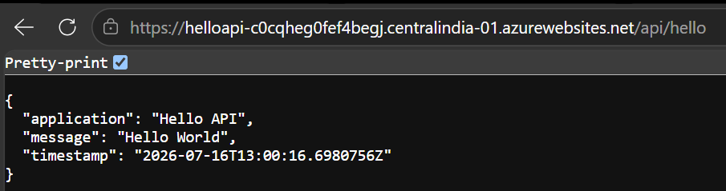

# Azure App Service → Logic App → Azure Blob Storage Integration PoC

## Overview

This Proof of Concept (PoC) demonstrates an end-to-end Azure integration where an **ASP.NET Core (.NET 8) Web API** hosted on **Azure App Service** is periodically invoked by an **Azure Logic App**. The Logic App retrieves a JSON response from the API and stores it as a **timestamped JSON file** in **Azure Blob Storage** using **Managed Identity**, eliminating the need for storage account keys or connection strings.

---

# Architecture


---

# Solution Workflow

```text
                Azure App Service
               (.NET 8 Web API)
                       │
                 HTTP GET Request
                       │
                       ▼
                Azure Logic App
            (Recurrence Trigger)
                       │
                       ▼
        Azure Blob Storage Connector
        (Managed Identity Authentication)
                       │
                       ▼
          Azure Blob Storage Container
              (api-output)
```

---

# Features

- ASP.NET Core (.NET 8) REST API
- Azure App Service
- Azure Logic App (Consumption)
- Azure Blob Storage
- Managed Identity Authentication
- Azure RBAC
- Dynamic blob naming using UTC timestamp
- Passwordless authentication

---

# Azure Services Used

| Service | Purpose |
|----------|----------|
| Azure App Service | Hosts the REST API |
| Azure Logic Apps | Workflow orchestration |
| Azure Blob Storage | Stores JSON payload |
| Managed Identity | Secure authentication |
| Azure RBAC | Authorization to Blob Storage |

---

# Repository Structure

```text
LCT_DEMOAPIBLOBCONNECTPOC
│
├── api
│   └── HelloApi
│       ├── Controllers
│       ├── Properties
│       ├── appsettings.json
│       ├── appsettings.Development.json
│       ├── HelloApi.csproj
│       ├── HelloApi.http
│       └── Program.cs
│
├── docs
│   ├── architecture.png
│   ├── api-response.png
│   └── setup.md
│
├── logic-app
│   ├── workflow.json
│   └── screenshots
│
├── .gitignore
└── README.md
```

---

# API Endpoint

```
GET /api/hello
```

Example Response

```json
{
    "application": "Hello API",
    "message": "Hello World",
    "timestamp": "2026-07-16T18:40:12Z"
}
```

---

# Sample API Response



---

# Logic App Workflow

The Logic App performs the following steps:

1. Triggered on a Recurrence schedule.
2. Sends an HTTP GET request to the Azure App Service.
3. Receives the JSON response.
4. Generates a blob name using the current UTC timestamp.
5. Creates a JSON blob in Azure Blob Storage.

The workflow definition is available here:

```
logic-app/workflow.json
```

---

# Security

This solution follows Azure security best practices.

- ✅ System Assigned Managed Identity
- ✅ Azure RBAC
- ✅ Storage Blob Data Contributor Role
- ✅ No Storage Account Keys
- ✅ No Connection Strings

---

# Dynamic Blob Naming

Each execution generates a unique filename.

Example:

```
HelloApi_20260716_191530.json
```

Expression used inside Logic App:

```text
concat(
'HelloApi_',
formatDateTime(utcNow(),'yyyyMMdd_HHmmss'),
'.json'
)
```

---

# Setup Guide

Detailed deployment instructions are available in:

```
docs/setup.md
```

The guide includes:

- Creating Azure resources
- Deploying the API
- Configuring Managed Identity
- Assigning Azure RBAC
- Creating the Logic App
- Testing the solution
- Troubleshooting

---

# Troubleshooting

One issue encountered during development:

### IIS "You do not have permission to view this directory or page"

Cause:

The project source folder was deployed instead of the published application.

Resolution:

Run

```bash
dotnet publish -c Release -o ./bin/Publish
```

Deploy the contents of

```
bin/Publish
```

instead of the project root.

---


# Author

**Supriyo Sarkar**

Azure | DevOps | Kubernetes | Terraform | Azure Integration